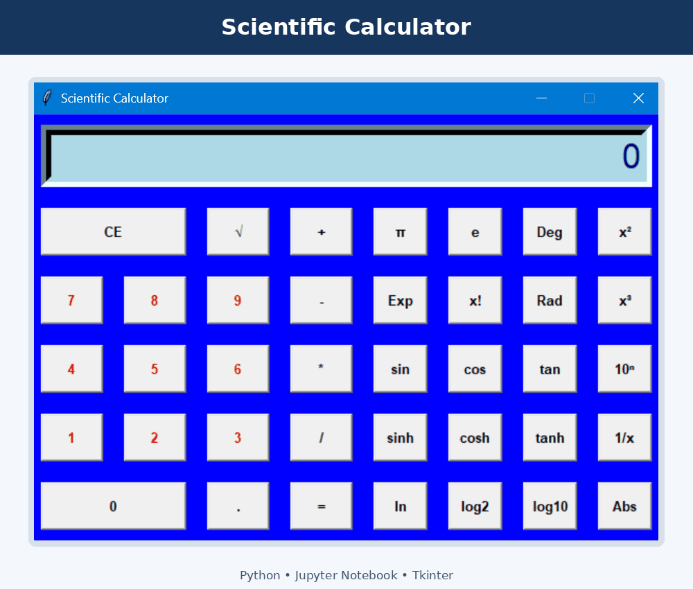

# 🐍 Python GUI Projects

A collection of beginner Python projects created to practise graphical user interfaces, functions, input handling, and basic database operations.

## 📌 Projects

| Project | Description | Main Tools | Open Notebook |
|---|---|---|---|
| Scientific Calculator | A desktop calculator with a Tkinter interface and scientific mathematical operations. | Python, Tkinter, Math | [View Calculator](Shreya%20CALCULATOR%20.ipynb) |
| Password Generator | Generates passwords through a graphical interface and stores username/password records in a local SQLite database. | Python, Tkinter, SQLite, Random | [View Password Generator](Shreya%20PASSWORD%20GENERATOR%20.ipynb) |
| To-Do List | A desktop task manager that adds, displays, and removes tasks with SQLite storage. | Python, Tkinter, SQLite | [View To-Do List](Shreya%20To-Do-LIST%20.ipynb) |
| AlphaFold2 Exploration | An exploratory ColabFold/AlphaFold2 notebook for protein structure prediction. | Python, ColabFold, Bioinformatics | [View AlphaFold2 Notebook](AlphaFold2.ipynb) |

## 🖼️ Project Slideshow

  

The slideshow presents my Scientific Calculator, Password Generator, and To-Do List applications developed using Python, Jupyter Notebook, and Tkinter.

## 🧠 Skills Practised

- Python functions and classes
- Event-driven GUI programming with Tkinter
- User input and validation
- Random password generation
- Basic SQLite database operations
- Connecting biotechnology concepts with computational tools

## ▶️ How to Run the GUI Projects

The calculator, password generator, and to-do list use **Tkinter**, so they are intended to run in a local desktop Python environment. GitHub displays the code but does not run desktop applications.

1. Download the required `.ipynb` notebook.
2. Open it in Jupyter Notebook or VS Code.
3. Confirm that Python 3 and Tkinter are installed.
4. Run the code cell.
5. The application should open in a separate desktop window.

> Google Colab normally cannot display a Tkinter desktop window directly. Use Jupyter Notebook or VS Code on your computer for these three projects.

## 👩‍💻 Author

**Shreya Gupta**

- [GitHub Profile](https://github.com/Shreya-88)
- [LinkedIn](https://www.linkedin.com/in/shreya-gupta-biotech)

